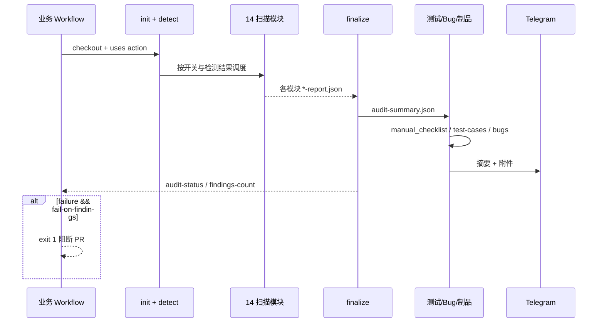

# Code Audit Skill — 架构设计

> 角色：架构师 | 最后更新：2026-07-01

---

## 一、总体架构

```
┌─────────────────────────────────────────────────────────────────┐
│                        业务仓库 (Consumer)                        │
│  .github/workflows/code-audit.yml  (3~15 行)                     │
│  checkout → uses: ORG/code-audit-skill@main                      │
└────────────────────────────┬────────────────────────────────────┘
                             │ GITHUB_ACTION_PATH
                             ▼
┌─────────────────────────────────────────────────────────────────┐
│                     Skill 仓库 (本仓库)                           │
├─────────────────────────────────────────────────────────────────┤
│  action.yml          Composite Action 编排层                      │
│  scripts/init.sh     环境初始化、开关解析、目录创建                  │
│  scripts/detect-*    语言/依赖检测 → 条件跳过                       │
│  scripts/run-*.sh    外部工具适配层 (gitleaks/bandit/trivy/...)   │
│  scripts/audit-engine.py  内置 SAST/专项/差分/覆盖率引擎           │
│  scripts/finalize-*  结果汇总、状态判定                             │
│  scripts/generate-*  测试用例 / Bug 报告                           │
│  scripts/send-telegram.sh  通知层                                 │
│  config/*.yaml       规则与 TG 配置（Skill 仓内加载）                │
└────────────────────────────┬────────────────────────────────────┘
                             │
         ┌───────────────────┼───────────────────┐
         ▼                   ▼                   ▼
   Actions 制品        Telegram API        Job 成功/失败
```

### 双仓职责

| 层 | 仓库 | 职责 |
|----|------|------|
| 消费层 | 业务仓 | checkout、触发条件、可选 TG 覆盖、分支保护 |
| 能力层 | Skill 仓 | 全部审计逻辑、规则、脚本、默认 TG |

---

## 二、分层设计

### L0 — 编排层 (`action.yml`)

- 定义 **inputs / outputs**
- 按固定顺序调用 composite steps
- 模块 step 统一 `continue-on-error: true`，避免单工具失败拖垮流水线
- 最终由 `finalize` + `审计失败判定` step 决定是否 `exit 1`

### L1 — 初始化层 (`init.sh`, `detect-languages.sh`)

| 职责 | 输出 |
|------|------|
| 解析 `enable-*` 开关（大小写不敏感） | `steps.init.outputs.enable_*` |
| 创建工作目录 `$AUDIT_DIR` | artifacts / results 子目录 |
| 检测 Python / 依赖清单 / 可 lint 代码 | `has_python`, `has_dependencies`, `has_lintable_code` |

**设计原则**：无对应代码 → 下游 step `if` 跳过，不产生 false failure。

### L2 — 扫描层

#### 2a 外部工具适配

| 模块 | 脚本 | 工具 |
|------|------|------|
| gitleaks | `run-gitleaks.sh` | gitleaks |
| super-linter | `run-super-linter.sh` | github/super-linter |
| bandit | `run-bandit.sh` | bandit |
| dependency_scan | `run-dependency-scan.sh` | trivy |
| custom_rules | `run-custom-rules.sh` | YAML 规则引擎 |

各脚本约定：写入 `$RESULTS_DIR/{module}-report.json`，含 `findings[]` 与 `status`。

#### 2b 内置审计引擎

- 入口：`run-audit-module.sh` + `AUDIT_MODULE` 环境变量
- 实现：`audit-engine.py` 单文件多模块 dispatch
- 配置：`config/sast-patterns.yaml`、`config/audit-methods.yaml`

支持模块：`sast_patterns` | `taint_analysis` | `control_flow` | `config_audit` | `specialized_security` | `diff_audit` | `coverage_audit` | `runtime_audit` | `manual_checklist`

### L3 — 汇总层 (`finalize-results.sh`)

- 合并各模块 JSON → `audit-summary.json`
- 计算 `findings-count`、`audit-status`（success / failure / skipped）
- 输出供后续步骤与 Action outputs 使用

### L4 — 增值层

| 组件 | 脚本 | 说明 |
|------|------|------|
| 测试用例 | `generate-test-cases.py` → `execute-test-cases.py` | 基于审计结果生成九种设计方法的验收用例 |
| Bug 报告 | `generate-bug-report.py` | 统一 BUG-ID、严重级别、修复建议 |
| 制品打包 | `bundle-audit-logs.sh` | 合并日志供 TG 发送 |

### L5 — 通知层 (`load-telegram-config.sh` + `send-telegram.sh`)

配置优先级：

```
workflow with 参数  >  环境变量  >  config/telegram.yaml
```

TG 发送失败 → `continue-on-error: true`，不影响审计结论。

---

## 三、执行流程（时序）



---

## 四、关键架构决策（ADR 摘要）

### ADR-001：Composite Action 而非 Reusable Workflow

| 选项 | 结论 |
|------|------|
| Reusable Workflow | 业务仓仍需复制 job 结构 |
| **Composite Action** ✅ | 单 step 接入，逻辑内聚于 Skill 仓 |

### ADR-002：规则与 TG 配置放在 Skill 仓

| 理由 | 权衡 |
|------|------|
| 改规则 push 即全局生效 | 多租户需 workflow 覆盖 TG |
| 业务仓零 Secrets 接入 | Fork PR 无法读 Secrets（已文档化） |

### ADR-003：模块失败降级而非 fail-fast

- 各扫描 step：`continue-on-error: true`
- 汇总层统一判定；仅 `fail-on-findings` 控制 Job 失败
- **收益**：trivy 安装失败时 bandit 结果仍可用

### ADR-004：内置 Python 引擎 vs 全外部工具

- 词法/污点/控制流/专项等：**自研轻量引擎**（`audit-engine.py`）
- 密钥/SCA/规范：**成熟 CLI**（gitleaks、trivy、super-linter）
- **理由**：CI 时间可控、规则 YAML 化、无额外 SaaS 依赖

### ADR-005：版本引用策略

- 默认文档推荐 `@main` 跟踪最新能力
- 生产建议锁定 **commit SHA** 或 **tag**（待 M5 发布）

### ADR-006：制品与日志

- 统一目录：`$AUDIT_DIR/artifacts/`
- Artifact 名：`code-audit-logs-{run_id}`
- 默认保留 14 天，可 `artifact-retention-days` 调整

---

## 五、数据流与文件约定

```
$AUDIT_DIR/
├── results/
│   ├── gitleaks-report.json
│   ├── bandit-report.json
│   ├── sast_patterns-report.json
│   └── ...
├── artifacts/
│   ├── audit-summary.json      ← 汇总
│   ├── audit-bugs.md / .json
│   ├── test-cases.md / .json
│   ├── manual-audit-checklist.md
│   └── audit-logs-combined.txt
```

### 模块报告 JSON 最小契约

```json
{
  "module": "gitleaks",
  "status": "success | failure | skipped",
  "findings_count": 0,
  "findings": [
    {
      "file": "path/to/file",
      "line": 1,
      "severity": "high | medium | critical | info",
      "message": "描述",
      "snippet": "可选代码片段"
    }
  ]
}
```

---

## 六、安全与权限

| 项 | 设计 |
|----|------|
| workflow permissions | 建议 `contents: read`, `pull-requests: read` |
| TG Token | 默认 Skill 仓 yaml；生产推荐 Secrets 覆盖 |
| super-linter | 需要 `GITHUB_TOKEN`（只读即可） |
| 差分审计 | checkout `fetch-depth: 0` |

---

## 七、扩展点

| 扩展 | 方式 |
|------|------|
| 新业务规则 | `config/custom-rules/business-rules.yaml` 或 `custom-rules-path` input |
| 忽略路径 | `config/ignore-paths.txt` 或 `ignore-paths-file` |
| 新扫描模块 | `action.yml` 增 step + `init.sh` 开关 + spec 文档 |
| 新通知渠道 | 新增 L5 适配脚本，不改扫描层 |

---

## 九、记忆层

> 详规：[memory/README.md](./memory/README.md)

### 定位

| 层级 | 文档 | 变更频率 |
|------|------|----------|
| 稳定契约 | proposal / design / specs / tasks | 低 |
| **会话态** | memory/CONTEXT.md | 每任务 |
| **变更态** | memory/reports/*-diff.md | 每任务 |
| **交付态** | memory/reports/*-completion.md | 每任务 |

### 组件

```
docs/memory/
├── CONTEXT.md       # 热快照（Agent 优先读，省 Token）
├── module-map.yaml  # 路径 → 模块 → 功能影响
├── templates/       # diff / completion 模板
└── reports/         # 自动生成报告
scripts/generate-memory-report.py  # git diff + 影响分析
```

### 工作流

1. **开任务**：`--init-intake` → 填六棱镜 + 功能矩阵 → [REQUIREMENT-GUIDE.md](./memory/REQUIREMENT-GUIDE.md)
2. **读 CONTEXT**：`memory/CONTEXT.md` + 单模块 spec
3. **关任务**：`generate-memory-report.py` → diff + **requirement-audit** + completion
4. **收尾**：audit §7 门禁 → 更新 CONTEXT + tasks

---

## 十、需求理解层（六棱镜）

| 组件 | 文件 | 作用 |
|------|------|------|
| 棱镜定义 | `memory/requirement-lens.yaml` | 6 视角 + 5 维完整性 + 8 项逻辑 |
| 开任务 | `memory/intake/{ID}.md` | 多样性理解、功能探索矩阵 |
| 关任务 | `reports/*-requirement-audit.md` | 需求↔实现↔契约 比对 |
| 指南 | `memory/REQUIREMENT-GUIDE.md` | 三阶段工作流 |

---

## 十一、相关文档

- 产品边界 → [proposal.md](./proposal.md)
- 模块接口契约 → [specs/](./specs/)
- 任务拆解 → [tasks.md](./tasks.md)
- 记忆层 → [memory/README.md](./memory/README.md)
- 需求六棱镜 → [memory/REQUIREMENT-GUIDE.md](./memory/REQUIREMENT-GUIDE.md)
- 可行性与扩展 → [GUIDANCE.md](./GUIDANCE.md)
